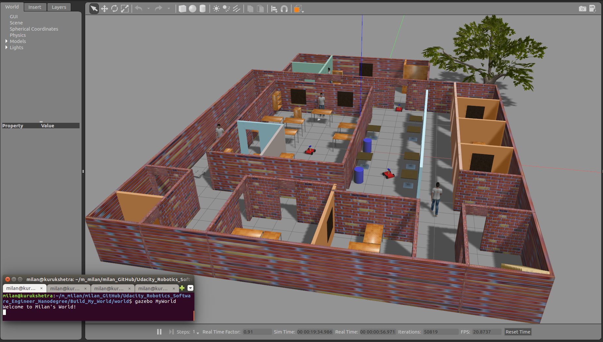

[](https://www.udacity.com/robotics)

# Udacity Nanodegree: Robotics Software Engineer

## Project 01: Build My World

### Directory Structure
```

.Build_My_World                 # Build My World main folder
├── docs                        # Code output documents
│   └── images
│       └── Milan_World.png
├── model                       # Model files
│   ├── MyBuilding              # Created Building through Building Editor
│   │   ├── model.config
│   │   └── model.sdf
│   ├── MyInspectionRobot       # Robot with Camera
│   │   ├── model.config
│   │   └── model.sdf
│   └── MyRobot                 # Simple Robot
│       ├── model.config
│       └── model.sdf
├── script                      # Gazebo World plugin C++ script
│   └── welcome.cpp
├── world                       # Gazebo main World containing models
│   └── MyWorld
├── CMakeLists.txt              # Link libraries
└── Proj01_README.md            # README file for this Project 01: Build My World

```

### Output

